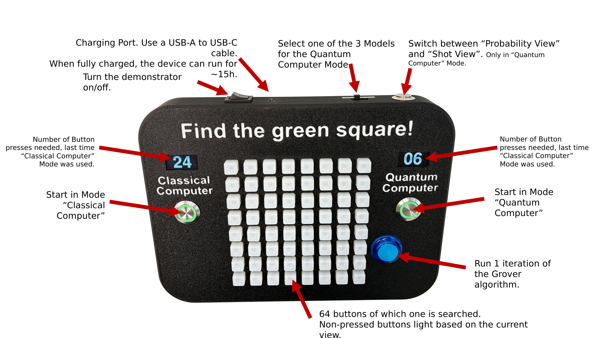

# Grover-Demonstrator
A simple hardware demonstrator to let the user experience classical search in unstructured data, vs the Grover quantum computer algorithm.

## What can it be used for?

- [Showing how (computationally) hard it is to find something in unstructured data](#showing-how-computationally-hard-it-is-to-find-something-in-unstructured-data)
- [Showing the "quantum advantage" that the Grover algorithm can provide](#showing-the-quantum-advantage-that-the-grover-algorithm-can-provide)
- [Showing the relationship between shots and the probability distribution](#showing-the-relationship-between-shots-and-the-probability-distribution)
- [Showing the impact of noise on the results of quantum computers / the Grover algorithm](#showing-the-impact-of-noise-on-the-results-of-quantum-computers--the-grover-algorithm)
- [Attracting people to a booth by having it blink](#attracting-people-to-a-booth-by-having-it-blink)

## Device overview

| Control | Description |
|---|---|
| On/off switch (top) | Turns the demonstrator on/off. |
| Charging port (top) | Use a USB-A to USB-C cable. When fully charged, the device can run for ~15 h. |
| Model slider (top) | Selects one of the 3 models for "Quantum Computer" mode. |
| Round button (top right) | Switches between "Probability View" and "Shot View". Only in "Quantum Computer" mode. |
| "Classical Computer" button | Starts in "Classical Computer" mode. |
| "Quantum Computer" button | Starts in "Quantum Computer" mode. |
| Left display | Number of button presses needed the last time "Classical Computer" mode was used. |
| Right display | Number of button presses needed the last time "Quantum Computer" mode was used. |
| Blue button | Runs 1 iteration of the Grover algorithm. |
| 8 × 8 button grid | 64 buttons, one of which is searched. Non-pressed buttons light up based on the current view. |

## Showing how (computationally) hard it is to find something in unstructured data

1. Start the demonstrator in "Classical Computer" mode and give it to a user.
2. Their task is to find the one button (of the 64 square ones) that blinks green when pushed.
3. This is an example of search in unstructured data: the user has no idea which button will light green.
4. You can discuss with them that with 64 buttons, they will need 32 tries on average.

A good example of search in unstructured data is guessing a password or decrypting data with no information about the key. You can verify that a solution is correct (you can try to decrypt the data), but there are no strategies to speed up the search. This is different from search problems with structured data, where you can, for example, sort the data to make it easier to search through.

Buttons that have not been pressed glow in a blue hue. The brighter they are, the more likely they are the correct button. As the data are unstructured, all buttons glow equally bright, but they become brighter as fewer buttons are left to be pressed.

> [!TIP]
> If the user found the green button in just a few steps, you can ask them or someone else to try again.

## Showing the "quantum advantage" that the Grover algorithm can provide

1. The user should have used/seen the "Classical Computer" mode already.
2. Make sure the demonstrator uses the **"Ideal"** model.
3. Start "Quantum Computer" mode. The user must again find the green button, ideally with fewer button presses. You can either let them search or do it yourself.

Again, buttons that have not been pressed glow in a blue hue. The brighter they are, the more likely they are the correct button. Initially, all buttons are equally bright, as there is no information about the correct result.

The user can "spend" a button press by pressing the blue button, which causes the Grover search algorithm to improve the prediction of the button that is searched.

When the blue button has been pressed 6 times, the prediction will be best. You can "undo" blue button presses by pressing the "Classical Computer" button. This is sometimes helpful when explaining the algorithm.

Thus, the optimal strategy seems to be to press the blue button once, then the brightest button. This strategy is less ideal with noise and high shot costs.

## Showing the relationship between shots and the probability distribution

1. The user should have used/seen the "Classical Computer" mode already.
2. Start "Quantum Computer" mode. The user must again find the green button, ideally with fewer button presses. You can either let them search or do it yourself.
3. Press the round button at the top of the device to switch to "Shot" mode.

In Shot mode, the buttons do not glow based on their likelihood. Instead, individual shots of the quantum computer are simulated. After the Grover algorithm is computed, the quantum state is read out, resulting in one random result based on the probabilities given by the quantum state of the qubits.

This mode makes it much more difficult to find the correct result without the ideal number of Grover algorithm iterations (blue button presses), especially when the "Real" model is used.

## Showing the impact of noise on the results of quantum computers / the Grover algorithm

1. The user should have used/seen the "Classical Computer" mode already.
2. Start "Quantum Computer" mode. The user must again find the green button, ideally with fewer button presses. You can either let them search or do it yourself.
3. When the blue Grover button has been pressed a few times, use the slider at the top to change between models:
   - **Ideal**: Simulation of a quantum computer without any noise/errors.
   - **Model**: Simple error model that introduces some gate errors.
   - **Real**: Results from a real IBM quantum computer.

The difference between the models is most easily visible when the buttons show probabilities, but Shot mode can also be used.

## Attracting people to a booth by having it blink

1. Start the device in "Quantum Computer" mode and press the round button on the top to switch to "Shot" mode.
2. Place the demonstrator so people can see the buttons blinking.
